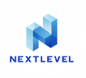
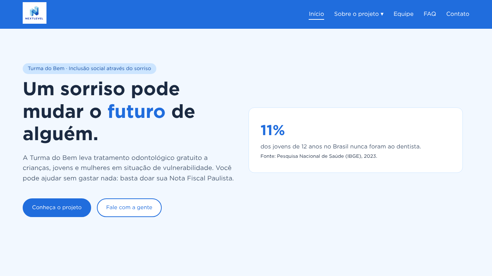
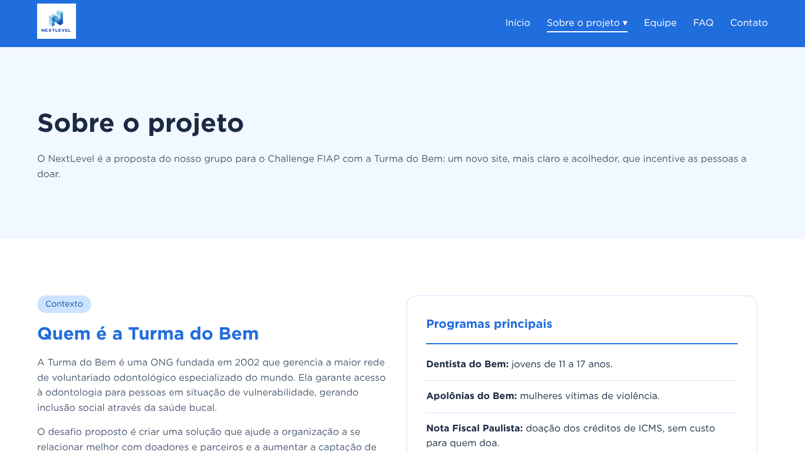
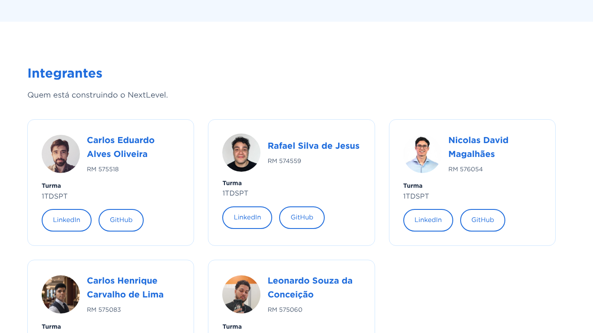
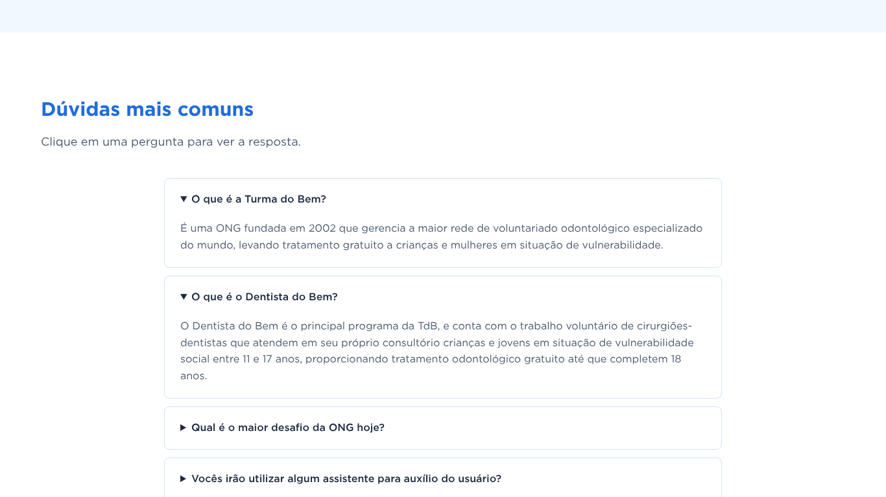
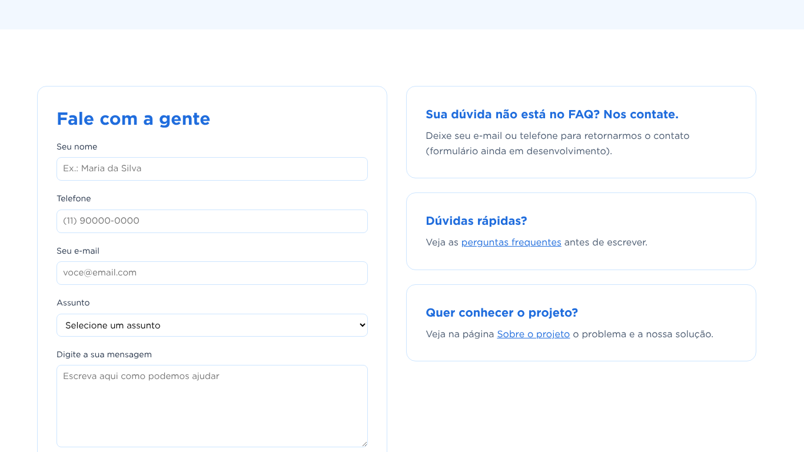
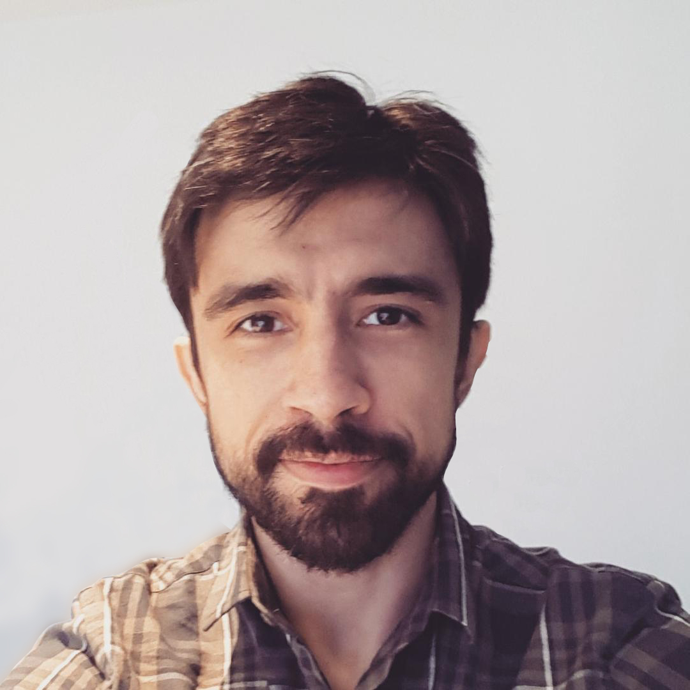
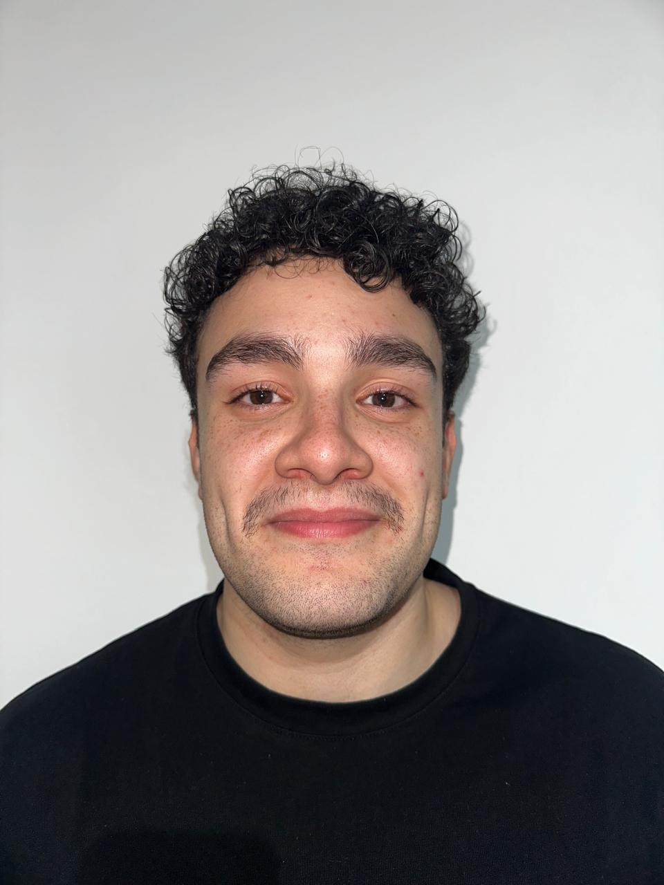
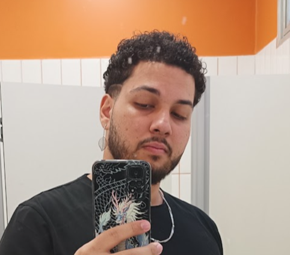

<p align="center">
  
</p>

<h1 align="center">NextLevel – Challenge Turma do Bem</h1>

<p align="center">
  Proposta de novo site para a <strong>Turma do Bem</strong>, desenvolvida no Challenge FIAP (1TDS · 2026).<br />
  <em>Projeto acadêmico: não é o site oficial da Turma do Bem.</em>
</p>

<p align="center">
  🌐 <a href="https://nextlevel-1tdspt.github.io/challenge_front_end/"><strong>Acessar o site</strong></a>
  &nbsp;·&nbsp;
  📁 <a href="https://github.com/NextLevel-1TDSPT/challenge_front_end"><strong>Repositório no GitHub</strong></a>
</p>

---

## 📌 Sobre o projeto

A **Turma do Bem** é uma ONG fundada em 2002 que gerencia a maior rede de voluntariado odontológico especializado do mundo, levando tratamento gratuito a jovens e mulheres em situação de vulnerabilidade.


Hoje, 90% das doações vêm de empresas e só **10% de pessoas físicas**. Um site que emocione e convide a doar é o caminho para aumentar a participação de quem visita o site.

O **NextLevel** propõe:

- **Um site novo**, acolhedor e com um caminho claro para doar;
- **Um assistente virtual (chatbot)**, que explica a doação pela Nota Fiscal Paulista e faz o cadastro de doadores da Turma do Bem.

> **Sprint 1:** todas as páginas em HTML e CSS, apenas na versão **desktop** (≥ 992px e ≥ 1300px), sem JavaScript.

---

## 🛠️ Tecnologias utilizadas

| Tecnologia | Uso no projeto |
|---|---|
| HTML5 | Estrutura semântica das páginas |
| CSS3 | Estilo, layout com Flexbox e media queries para desktop |
| Git e GitHub | Versionamento e trabalho em equipe |
| GitHub Pages | Publicação do site |
| Figma | Protótipo e identidade visual |
| VS Code | Editor de código |

Sem frameworks ou bibliotecas externas. Fonte utilizada: **Gotham** (arquivos locais).

---

## 📂 Estrutura de pastas

```
challenge_front_end/
├── index.html              # Página inicial
├── README.md               # Este guia
├── css/
│   ├── style.css           # Estilos do site (organizado por seções)
│   └── fonts.css           # Importação da fonte Gotham
├── fonts/                  # Arquivos da fonte Gotham (.otf)
├── imagens/                # Logo, fotos dos integrantes e prints do README
│   └── prints/
└── pages/
    ├── sobre.html          # Contexto, problema, solução, tecnologias e roadmap
    ├── integrantes.html    # Equipe
    ├── faq.html            # Perguntas frequentes
    └── contato.html        # Formulário de contato
```

---

## 🖥️ Páginas do site

| Página | Conteúdo |
|---|---|
| **Início** | Apresentação do projeto, programas da Turma do Bem e chamada para doar |
| **Sobre o projeto** | Contexto, problema encontrado, solução proposta, tecnologias e roadmap |
| **Equipe** | Nome, foto, RM, turma, LinkedIn e GitHub de cada integrante |
| **FAQ** | Perguntas frequentes sobre a ONG, as doações e o projeto |
| **Contato** | Formulário com nome, telefone, e-mail, assunto e mensagem |

### Prints

**Página inicial**


**Sobre o projeto**


**Equipe**


**FAQ**


**Contato**


---

## 👥 Autores

| Foto | Nome | RM | Turma | LinkedIn | GitHub |
|:---:|---|---|---|---|---|
|  | Carlos Eduardo Alves Oliveira | 575518 | 1TDSPT | [LinkedIn](https://www.linkedin.com/in/caduoliveirarj/) | [cadubrrj-beep](https://github.com/cadubrrj-beep) |
|  | Rafael Silva de Jesus | 574559 | 1TDSPT | [LinkedIn](https://linkedin.com/in/rafaeljesus01) | [RafaJesus3](https://github.com/RafaJesus3) |
|  | Nicolas David Magalhães | 576054 | 1TDSPT | [LinkedIn](https://www.linkedin.com/in/nicolas-david-magalhaes-0b398742a/) | [Nicolasdmagalhaes](https://github.com/Nicolasdmagalhaes) |
|  | Carlos Henrique Carvalho de Lima | 575083 | 1TDSPT | [LinkedIn](https://www.linkedin.com/in/carlos-henrique-carvalho-de-lima-606b033bb/) | [CarlRickCliman](https://github.com/CarlRickCliman) |
|  | Leonardo Souza da Conceição | 575060 | 1TDSPT | [LinkedIn](https://www.linkedin.com/in/leonardo-souza-da-concei%C3%A7%C3%A3o/) | [LeonardoSC-eng](https://github.com/LeonardoSC-eng) |

---

## 📬 Contato

Dúvidas ou sugestões sobre o projeto? Fale com a equipe:

- Pelos **LinkedIns** dos integrantes, na tabela acima;
- Abrindo uma [issue no repositório](https://github.com/NextLevel-1TDSPT/challenge_front_end/issues).
